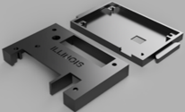

# Building the Illinois RapidAlarm

The Illinois RapidAlarm is designed to be produced quickly and easily by both individuals and manufacturers. This page explains how to build the Illinois RapidAlarm.

## What you'll need

### 1. Printed circuit board

The electronic components are mounted on a printed circuit board (PCB). The two-layer, through-hole circuit board can be produced using a hobbyist-quality PCB router or produced by a manufacturer using the provided design files:

[Through-hole circuit board design files](https://github.com/rapidalarm/rapidalarm/tree/master/pcb/pcb_proto)

The repository also includes a [surface-mount board design](https://github.com/rapidalarm/rapidalarm/tree/master/pcb/pcb_smd) that is still under development. It will allow circuit boards to be produced and assembled using pick-and-place manufacturing. 

<!-- 

- [Design Files](https://github.com/rapidalarm/rapidalarm/tree/master/pcb/pcb_smd)
- [Source Code]()
-->

### 2. Enclosure

The Illinois RapidAlarm uses an enclosure that can be produced using 3D printer:

[3D-printed enclosure design files](https://github.com/rapidalarm/rapidalarm/tree/master/cad/enclosure_3Dprint)

<!-- [Laser-cut enclosure design files]((https://github.com/rapidalarm/rapidalarm/tree/master/cad/enclosure_lasercut) -->

### 3. Parts

The following components are required to assemble the Illinois RapidAlarm. The links provided are to Digikey, but many other suppliers carry compatible parts.

|Quantity | Part                | Part Number       | Digikey                                                                                                                                                                                                            | Notes                                               |
| ----                | -----------        | -------- | -------                                                                                                                                                                                                            | ------                                              |
| 1 | Atmega328 microcontroller | ATMEGA328P-PU     | [Link](https://www.digikey.com/product-detail/en/microchip-technology/ATMEGA328P-PU/ATMEGA328P-PU-ND/1914589)                                                                                                      |                                                     |
| 1 | Pressure sensor | MPXV5010GC7U       | [Link](https://www.digikey.com/product-detail/en/nxp-usa-inc/MPXV5010GC7U/MPXV5010GC7U-ND/412949)                                                                                                                  | See alternatives below                                 |
| 1 | Buzzer              | PKM13EPYH4002-B0   | [Link](https://www.digikey.com/product-detail/en/murata-electronics/PKM13EPYH4002-B0/490-4697-ND/1219328)                                                                                                          |                                                     |
| 3 | Tactile switch      | 1825910-6          | [Link](https://www.digikey.com/product-detail/en/te-connectivity-alcoswitch-switches/1825910-6/450-1650-ND/1632536)                                                                                                |                                                     |
| 1 | 1uF capacitor       | UVK1H010MDD1TD     | [Link](https://www.digikey.com/product-detail/en/nichicon/UVK1H010MDD1TD/493-12567-3-ND/4328768)                                                                                                                   | Any >5V electrolytic will do                        |
| 3 | 0.1uF capacitor     | C315C104M5U5TA7303 | [Link](https://www.digikey.com/product-detail/en/kemet/C315C104M5U5TA7303/399-9859-1-ND/3726100)                                                                                                                   | Any >5V ceramic will do                             |
| 2 | Resistor network    | 4606X-102-681LF    | [Link](https://www.digikey.com/product-detail/en/bourns-inc/4606X-102-681LF/4606X-2-681LF-ND/1089048)                                                                                                              |                                                     |
| 1 | 4 character display | LTC-4627JF         | [Link](https://www.digikey.com/product-detail/en/lite-on-inc/LTC-4627JF/160-1548-5-ND/408221)                                                                                                                      | Should work with most common anode 4 char displays. |
| 1 | 10k resistor        | CF14JT10K0         | [Link](https://www.digikey.com/product-detail/en/stackpole-electronics-inc/CF14JT10K0/CF14JT10K0CT-ND/1830374)                                                                                                     | Any 10k will do                                     |
| 1 | Barrel connector    | 694106301002       | [Link](https://www.digikey.com/product-detail/en/wurth-electronics-inc/694106301002/732-5930-ND/5047522?utm_adgroup=Barrel%20-%20Power%20Connectors&gclid=EAIaIQobChMIkbmT3LPS6AIVxJJbCh2gkADkEAQYAyABEgKTwfD_BwE) | 2.1mm ID, 5.5mm OD, center pos.                     |
| 1 | 5V adapter          | PSM03A-050-R       | [Link](https://www.digikey.com/product-detail/en/phihong-usa/PSM03A-050-R/993-1236-ND/4031882)                                                                                                                     | .                                                   |
| 1 | 6-pin 0.1" header (optional) |  68602-406HLF  | [Link](https://www.digikey.com/product-detail/en/amphenol-icc-fci/68602-406HLF/609-4934-ND/1657836) | Required if using  a 6-pin programmer (see below) |
| 4 | 2-56x3/4" screws | PMSSS 256 0075 PH  | [Link](https://www.digikey.com/product-detail/en/b-f-fastener-supply/PMSSS-256-0075-PH/H702-ND/274913) | |
| 4 | 2-56 nuts |  HNZ 256  | [Link](https://www.digikey.com/product-detail/en/b-f-fastener-supply/HNZ-256/H212-ND/5737) | |

The following alternative NXP pressure sensors can be used instead of the MPXV5010GC7U:
1. MPXV5010GP, MPXV5010DP
2. MPXV5100GC/GP/DP, MPXV5050GC/GP/DP, MPXV4006GC/GP/DP, MPXV7025GC/GP/DP - requires software scaling change

### 4. Required accessories

The following accessories are required to use the Illinois RapidAlarm. They should be included with the device if they are not already available at the medical facility.

- 5 volt power supply (e.g.,  [PSM03A-050-R](https://www.digikey.com/product-detail/en/phihong-usa/PSM03A-050-R/993-1236-ND/4031882)
- Respiratory adapter with stem (connects the ventilator to the tube)
- Tube with 1/16" (1.6mm) inner diameter (connects the repiratory adapter stem to the alarm module)

### 5. Tools and supplies

The following tools and supplies are required to produce the Illinois RapidAlarm:

- A soldering iron and solder to assemble the circuit board
- A screwdriver to assemble the enclosure
- A label maker or permanent marker to label the buttons on the enclosure
- A computer and AVR programmer to load the firmware onto the microcontroller. Here are several options:
  - A 6-pin [USBasp programmer](https://www.ebay.com/itm/USB-AVR-Programmer-w-6-Pin-10-Pin-IDC-ISP-Connector-For-USBASP/382191022734?hash=item58fc5c328e:g:zbcAAOSw1EhZjC5Z)  
  - Use an [Arduino as an ISP programmer](https://www.arduino.cc/en/tutorial/arduinoISP)  
  - Use a 6-pin [pogo adapter](https://www.ebay.com/itm/POGO-ICSP-AVR-Pogo-Pin-ICSP-ISP-Adapter-Kit/153891594446?hash=item23d4a760ce:g:jNYAAOSwzAxehgvi) (With this option, there is no need to install 6-pin headers on the circuit board.)

## Step 1: Assemble the circuit board

Solder the electronic components to the circuit board.

NOTE: There is a 6-pin in-circuit serial programming (ISP) header on the bottom side of the circuit board. This header is used to load software onto the microcontroller. If you are using a programmer with jumper wires, such as the USBasp or an Arduino, solder the 6-pin 0.1" header onto the bottom of the board **before** soldering in the ATmega328 microncontroller, as shown below. If you are using a pogo adapter, the header is not required.

## Step 2: Load the firmware

The Illinois RapidAlarm uses the Arduino platform to simplify microcontroller development and programming. Although there is no Arduino hardware in the Illinois RapidAlarm, the [Arduino integrated development environment](https://www.arduino.cc/en/Main/Software) is used to load the firmware onto the microcontroller.

1. Install the [Arduino IDE](https://www.arduino.cc/en/Main/Software) on the computer you will use to program the microcontroller.
2. Follow the [instructions](https://github.com/MCUdude/MiniCore#boards-manager-installation) for installing the MiniCore boards package.
3. Download the [Illinois RapidAlarm firmware source code](https://github.com/rapidalarm/rapidalarm/tree/master/code).
4. Connect the AVR programmer to the computer.
5. Select these options in the `Tools` menu of the Arduino IDE.  Default options should work except for those in bold.
   - **Board** - `ATmega328`
   - Variant - `328P / 328PA`
   - **Bootloader** - `No bootloader`
   - BOD - `BOD 2.7V`
   - **Clock** - `Internal 8MHz`
   - Compiler LTO - `LTO Disabled`
   - **Port** - (find the serial port that your programmer is connected to)
   - **Programmer** - `USBasp` (or select the appropriate option for your programmer)
6. Connect the programmer to the 6 pin ISP header on the back of the circuit board, as shown in the picture below. Do **not** connect a power supply to the board.
7. *For new microcontrollers only:* Select `Tools > Burn Bootloader`
8. In the Arduino IDE, open `alarm.ino` from the Illinois RapidAlarm firmware.
9. Select `Sketch > Upload` to load the firmware onto the microcontroller.
10. Disconnect the programmer from the circuit board. The microcontroller is now ready.

**WARNING**: Do not connect a power supply to the board while the programmer is connected. This could damage the programmer.

## Step 3: Assemble the Illinois RapidAlarm

Once the circuit board is assembled and programmed, you are ready to assemble all the pieces.

1. Place the circuit board inside the bottom piece of the encloser.
2. Use the 2-56x3/4" screws to secure the top piece of the enclosure to the bottom piece.
3. Label the MODE, UP, and DOWN buttons using a permanent marker or label maker.
