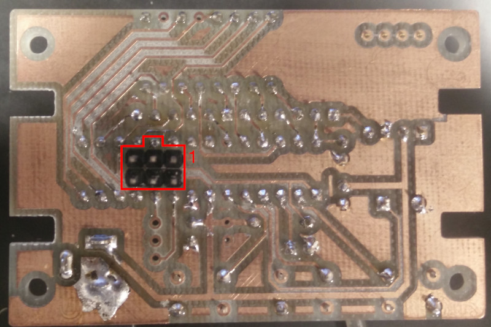

# Assembly Instructions

There are two variants of the Rapidalarm which have slightly different design requirements.

- Through hole - Uses entirely through hole components and minimal part count for easier hand assembly.  Board designed for hobby PCB router.
- Surface mount - All surface mount components.  Designed for mass-production on pick and place.  This is a work in progress.

Assembly instruction notes and bills of materials for each variant are below.

## Through Hole

- [Design Files](https://github.com/rapidalarm/rapidalarm/tree/master/pcb/pcb_proto)
- [Source Code](https://github.com/rapidalarm/rapidalarm/tree/master/code/alarm)

#### Bill of Materials

| Part                | Part Number        | Quantity | Digikey                                                                                                                                                                                                            | Notes                                               |
| ----                | -----------        | -------- | -------                                                                                                                                                                                                            | ------                                              |
| Atmega328           | ATMEGA328P-PU      | 1        | [Link](https://www.digikey.com/product-detail/en/microchip-technology/ATMEGA328P-PU/ATMEGA328P-PU-ND/1914589)                                                                                                      |                                                     |
| Pressure Transducer | MPXV5010GC7U       | 1        | [Link](https://www.digikey.com/product-detail/en/nxp-usa-inc/MPXV5010GC7U/MPXV5010GC7U-ND/412949)                                                                                                                  | Alternatives: 1, 2                                  |
| Buzzer              | PKM13EPYH4002-B0   | 1        | [Link](https://www.digikey.com/product-detail/en/murata-electronics/PKM13EPYH4002-B0/490-4697-ND/1219328)                                                                                                          |                                                     |
| Tactile Switch      | 1825910-6          | 3        | [Link](https://www.digikey.com/product-detail/en/te-connectivity-alcoswitch-switches/1825910-6/450-1650-ND/1632536)                                                                                                |                                                     |
| 1uF Capacitor       | UVK1H010MDD1TD     | 1        | [Link](https://www.digikey.com/product-detail/en/nichicon/UVK1H010MDD1TD/493-12567-3-ND/4328768)                                                                                                                   | Any >5V electrolytic will do                        |
| 0.1uF Capacitor     | C315C104M5U5TA7303 | 3        | [Link](https://www.digikey.com/product-detail/en/kemet/C315C104M5U5TA7303/399-9859-1-ND/3726100)                                                                                                                   | Any >5V ceramic will do                             |
| Resistor Network    | 4606X-102-681LF    | 2        | [Link](https://www.digikey.com/product-detail/en/bourns-inc/4606X-102-681LF/4606X-2-681LF-ND/1089048)                                                                                                              |                                                     |
| 4 character display | LTC-4627JF         | 1        | [Link](https://www.digikey.com/product-detail/en/lite-on-inc/LTC-4627JF/160-1548-5-ND/408221)                                                                                                                      | Should work with most common anode 4 char displays. |
| 10k Resistor        | CF14JT10K0         | 1        | [Link](https://www.digikey.com/product-detail/en/stackpole-electronics-inc/CF14JT10K0/CF14JT10K0CT-ND/1830374)                                                                                                     | Any 10k will do                                     |
| Barrel connector    | 694106301002       | 1        | [Link](https://www.digikey.com/product-detail/en/wurth-electronics-inc/694106301002/732-5930-ND/5047522?utm_adgroup=Barrel%20-%20Power%20Connectors&gclid=EAIaIQobChMIkbmT3LPS6AIVxJJbCh2gkADkEAQYAyABEgKTwfD_BwE) | 2.1mm ID, 5.5mm OD, center pos.                     |
| 5V adapter          | PSM03A-050-R       | 1        | [Link](https://www.digikey.com/product-detail/en/phihong-usa/PSM03A-050-R/993-1236-ND/4031882)                                                                                                                     | .                                                   |

Many of these components can be substituted with alternative components:

1. MPXV5010GP, MPXV5010DP
2. MPXV5100GC/GP/DP, MPXV5050GC/GP/DP, MPXV4006GC/GP/DP, MPXV7025GC/GP/DP - requires software scaling change

#### Assembly Notes

There is a 6-pin ISP header on the bottom side of the board for programming.  Either solder in a .1" header (before soldering in the ATmega328, or use a POGO pin adapter for programming.

## Surface Mount

- [Design Files](https://github.com/rapidalarm/rapidalarm/tree/master/pcb/pcb_smd)
- [Source Code]()

#### Bill of Materials

#### Assembly

## Programming

Rapidalarm can be programmed from the Arduino IDE.  A 6-pin [USBasp programmer](https://www.ebay.com/itm/USB-AVR-Programmer-w-6-Pin-10-Pin-IDC-ISP-Connector-For-USBASP/382191022734?hash=item58fc5c328e:g:zbcAAOSw1EhZjC5Z) is required.  Alternatively, one could use an [Arduino as an ISP programmer](https://www.arduino.cc/en/tutorial/arduinoISP).  It may also be desirable to use a 6-pin [POGO adapter](https://www.ebay.com/itm/POGO-ICSP-AVR-Pogo-Pin-ICSP-ISP-Adapter-Kit/153891594446?hash=item23d4a760ce:g:jNYAAOSwzAxehgvi)

1. Follow the [instructions](https://github.com/MCUdude/MiniCore#boards-manager-installation) for installing the MiniCore boards package.
2. Select these options in the `Tools` menu of the Arduino IDE.  Default options should work except for those in bold.
   - **Board** - `ATmega328`
   - Variant - `328P / 328PA`
   - **Bootloader** - `No bootloader`
   - BOD - `BOD 2.7V`
   - **Clock** - `Internal 8MHz`
   - Compiler LTO - `LTO Disabled`
   - **Port** - System dependent.
   - **Programmer** - `USBasp`
3. Connect the USBasp to the 6 pin ISP header on the back of the board, as shown in the picture below.
   
4. *For new boards only:* Select `Tools > Burn Bootloader`

The IDE is now ready and should be able to program Rapidalarm.

**WARNING**: Never simultaneously connect external power and the programmer, for risk of damaging the programmer's regulator.

