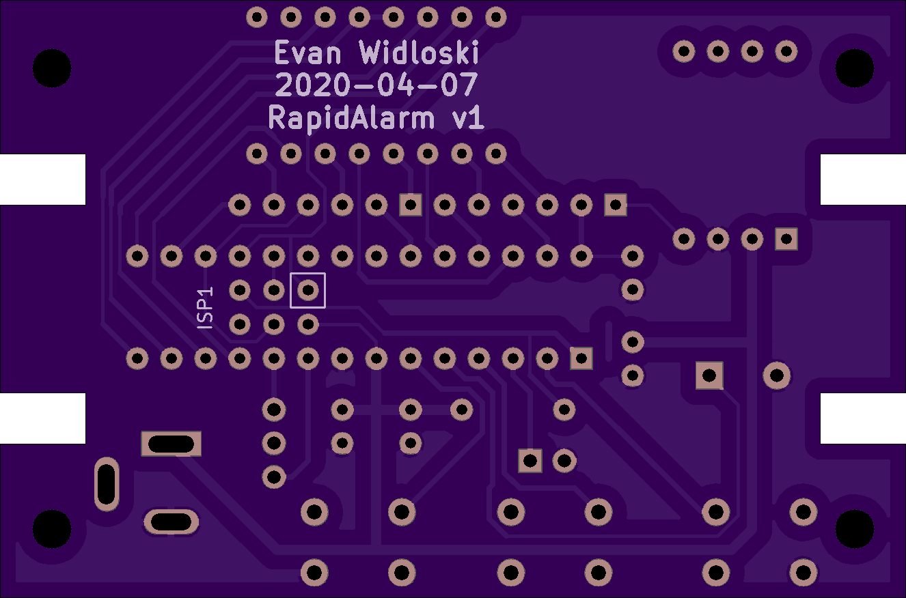

# Assembly Instructions

There are two variants of the Rapidalarm which have slightly different design requirements.

- Through hole - Uses entirely through hole components for easier hand assembly.  Board designed with hobbyist level PCB router in mind.
- Surface mount - All surface mount components.  Designed for mass-production on pick and place.

Assembly instruction and bill of materials for each variant are below.

## Through Hole

- [Design Files]()
- [Source Code]()

#### Bill of Materials

#### Assembly

## Surface Mount

- [Design Files]()
- [Source Code]()

#### Bill of Materials

#### Assembly

## Programming

Rapidalarm can be programmed from the Arduino IDE.  A 6-pin [USBasp programmer](https://www.ebay.com/itm/USB-AVR-Programmer-w-6-Pin-10-Pin-IDC-ISP-Connector-For-USBASP/382191022734?hash=item58fc5c328e:g:zbcAAOSw1EhZjC5Z) is required.  Alternatively, one could use an [Arduino as an ISP programmer](https://www.arduino.cc/en/tutorial/arduinoISP).

1. Follow the [instructions](https://github.com/MCUdude/MiniCore#boards-manager-installation) for installing the MiniCore boards package.
2. Select these options in the `Tools` menu of the Arduino IDE.  Default options should work except for those in bold.
   - **Board** - `ATmega328`
   - Variant - `328P / 328PA`
   - **Bootloader** - `No bootloader`
   - BOD - `BOD 2.7V`
   - **Clock** - `Internal 8MHz`
   - Compiler LTO - `LTO Disabled`
   - **Port** - System dependent.
   - **Programmer** - `USBasp`
3. Connect the USBasp to the 6 pin ISP header on the back of the board, as shown in the picture below.
   
4. *For new boards only:* Select `Tools > Burn Bootloader`

The IDE is now ready and should be able to program Rapidalarm.

**WARNING**: Never simultaneously connect external power and the programmer, for risk of damaging the programmer's regulator.

