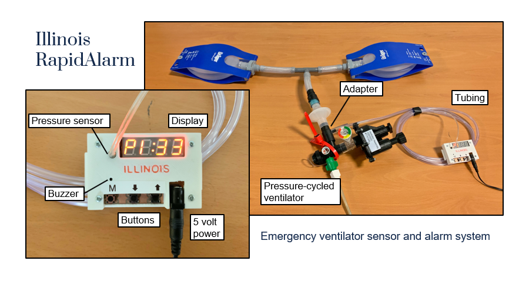

# Illinois RapidAlarm - Emergency ventilator sensor and alarm system

*Developed at the [Grainger College of Engineering](https://grainger.illinois.edu/) at the University of Illinois at Urbana-Champaign with support from Carle Health and Creative Thermal Solutions, Inc.*

<iframe style="display: block;margin: 3em auto 3em auto; width: 75%;" height="315" src="https://www.youtube.com/embed/8bSyTYTYtEM" frameborder="0" allow="accelerometer; autoplay; encrypted-media; gyroscope; picture-in-picture" allowfullscreen></iframe>

The Illinois RapidAlarm is a sensor and alarm module for use with emergency pressure-cycled ventilators such as the [Illinois RapidVent](https://rapidvent.grainger.illinois.edu/) that do not have built-in monitoring systems. The module connects to a ventilator circuit and monitors the pressure delivered to the patient airway. It produces an audible alarm when it detects a problem with the ventilator, such as a disconnection or obstruction, and also displays information about airway pressure and breathing rate. The Illinois RapidAlarm is designed to be quickly produced from readily available parts. The device can be assembled by hand or manufactured. This website contains open-source hardware designs, firmware code, and documentation to allow anyone to build their own Illinois RapidAlarm or to adapt the design to their own needs.

## Overview

Many emergency ventilators that have been developed in response to the COVID-19 pandemic do not have monitoring and alarm features that are available on more advanced ventilators. Pressure-cycled ventilators like the [Illinois RapidVent](https://rapidvent.grainger.illinois.edu/) are relatively easy to produce and are powered by air pressure, making them convenient solutions for emergency ventilation, but they require constant supervision by medical personnel. An external monitoring device, like the Illinois RapidAlarm, can provide important information to caregivers and alert them to problems that require immediate attention. 

The Illinois RapidAlarm, shown above, monitors pressure in the patient airway using an electronic pressure sensor, which connects to a ventilator circuit using a tube and adapter. The pressure signal is processed by an ATmega328 microcontroller (identical to the one found in the popular Arduino hobbyist kit), which calculates ventilation parameters and monitors for alarm conditions. A seven-segment display shows three measurements: peak inspiratory pressure (PIP), positive end-expiratory pressure (PEEP), and respiratory rate. A buzzer produces an audible alarm when the ventilator stops cycling or when the pressure or respiratory rate is outside normal operating range. The alarm conditions can be adjusted using three buttons on the front of the device.

### Features
- Connects to a pressure-cycled ventilator using standard tubing adapters.
- Powered by any 5 volt source, such as wall-mount adapters or USB phone chargers or battery packs.
- Audible alarm when the ventilator stops cycling, e.g. due to obstruction or disconnect.
- Audible alarm when pressure or respiratory rate fall outside their normal range.
- Alarm thresholds can be configured using buttons on the device.
- Display shows PIP (high pressure), PEEP (low pressure), and respiratory rate.
- Can be assembled by hand or by machine using inexpensive and readily available parts.

### Limitations
- The Illinois RapidAlarm is configured for and tested with the [Illinois RapidVent](https://rapidvent.grainger.illinois.edu/) emergency ventilator. It is likely to work with other pressure-cycled ventilators but may require additional configuration and testing. It may not work with ventilators that are not pressure-cycled.
- The Illinois RapidAlarm may be powered by a battery pack for portable use, but it does not monitor battery charge level and does not provide any warning or alarm when the battery is low. 
- Alarm settings are reset to default values when power is interrupted.
- The alarm may falsely trigger when the pressure settings of the ventilator are adjusted.
- While the alarm will trigger as soon as an alarm condition is detected, the values shown on the display are averaged over several breaths and may take up to 30 seconds to respond to large changes in pressure or respiratory rate. They may be inaccurate if breathing is irregular, shortly after alarm settings are changed, or during and shortly after an alarm is triggered.

## Resources
This website and the [Illinois RapidAlarm repository on Github](https://github.com/rapidalarm/rapidalarm) contain the resources required to produce the device:

- [Printed circuit board design files](https://github.com/rapidalarm/rapidalarm/tree/master/pcb)
- [Enclosure design files for 3D printing](https://github.com/rapidalarm/rapidalarm/tree/master/cad)
- [Firmware source code to run on the microcontroller](https://github.com/rapidalarm/rapidalarm/tree/master/code)
- [Instructions for producing and assembling the device](hardware.md)
- [User documentation](userguide.md)

## Specifications

### General characteristics
| Illinois RapidAlarm |     |
| ------------------- | --- |
| Patient population | Patients using pressure-cycled ventilators |
| Compatible ventilators | [Illinois RapidVent](https://rapidvent.grainger.illinois.edu/) and similar pressure-cycled ventilators |
| Patient interface | Connects via 1/8” (3.2 mm) inner diameter tube to tee fitting of breathing circuit |
| Environment of care | Stationary or portable (battery pack required for portable use) |
| Sterility | Not sterile |
| Size | 82 mm x 48 mm x 15.5 mm|
| Power required | 5 V DC, 100 mA |

### Displayed measurements

| Metric | Display range | Display resolution |
| ---- | ---- | ---- |
| PIP (High pressure) | 0-99 cm H2O | 1 cm H2O |
| PEEP (Low pressure) | 0-99 cm H2O | 1 cm H2O |
| Respiratory rate | 0-99 breaths/min | 1 breath/min |

### Alarm conditions

| Condition | Default setting | Adjustable range |
| --------- | --------------- | ---------------- |
| Non-cycling | 10 sec | 5–30 sec |
| Low pressure | 2 cm H2O | 1–20 cm H2O |
| High pressure | 40 cm H2O | 30–90 cm H2O |
| Low respiratory rate | 6 breaths/min | 5–15 breaths/min |
| High respiratory rate | 35 breaths/min | 15–60 breaths/min |

## Contact
Please contact the Illinois RapidAlarm team lead, Professor Andrew Singer (acsinger@illinois.edu), with any inquiries.
