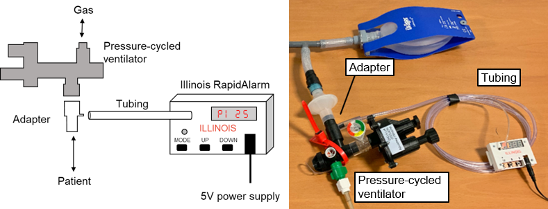

# User Guide

## Setup

1. Attach a tee adapter to the ventilator circuit on the patient side. If the ventilator is equipped with a manometer port, that port may be used instead.
2. Use a 1/16” (1.6 mm) inner diameter tube to connect the pressure sensor port on the Illinois RapidAlarm to the port on the ventilator. (Note: the picture above shows a series of tubes of increasing diameter. During use in clinical settings, direct connections should be used to minimize complexity.)
3. Connect the Illinois RapidAlarm to a 5V power supply. The device is available with either a barrel connector (pictured) or a micro-USB power connector. The micro-USB connector can be plugged into any USB port, including on a phone charger or battery pack.
4. Change alarm settings if desired (see below). Settings are reset to defaults whenever power is interrupted.

As soon as power is connected, the Illinois RapidAlarm will beep once to verify the buzzer is working, then begin cycling through measured parameters on its display.

## Display

The Illinois RapidAlarm cycles through three display measurements:

| Code | Metric | Display range | Display resolution |
| ---- | ------ | ------------- | ------------------ |
| `PI` | PIP (High pressure) | 0-99 cm H2O | 1 cm H2O |
| `PE` | PEEP (Low pressure) | 0-99 cm H2O | 1 cm H2O |
| `rr` | Respiratory rate | 0-99 breaths/min | 1 breath/min |

<!--

-->

.

**PIP (`PI`)**: the peak inspiratory pressure in cm H2O, measured as the maximum pressure in a breath cycle.

**PEEP (`PE`)**: the positive end-expiratory pressure in cm H2O, measured as the minimum pressure in the breath cycle. In assisted breathing, the minimum pressure may not equal the PEEP setting of the ventilator.

**Respiratory rate (`rr`)**: the number of complete breath cycles per minute, calculated from the time between the last several breaths.

**WARNING**: Although the system tracks pressure in real time to trigger alarms, the displayed measurements are averaged over several breath cycles and may take up to 30 seconds to reflect large changes in ventilator settings. The measurements may also be inaccurate when breathing is irregular, shortly after alarm settings are changed, or during and shortly after an alarm condition.

## User interface

The Illinois RapidAlarm has 3 buttons for changing modes and adjusting alarm settings

- **Mode** - cycles through display or setting modes
- **Up** - adjust alarm settings in the various settings modes
- **Down** - adjust alarm settings in the various settings modes

The Illinois RapidAlarm has three operating modes:

- **DISPLAY MODE**
  - Cycles through displaying PIP, PEEP, and respiratory rate every 2.5 seconds
  - Default mode when powered on.  
  - The monitor automatically returns to DISPLAY MODE from SET MODE after 30 seconds of no input.
- **ALARM MODE**
  - Alarm sounds continuously.
  - Display flashes alarm code.
  - Press any button to silence the alarm and return to DISPLAY MODE.
- **SET MODE**
  - Change the alarm thresholds.
  - Display shows alarm code and flashing threshold setting.
  - Press **Mode** button to cycle through settings:
     1.	Non-cycling (`nc`) alarm time (seconds)
     2.	Low pressure (`Lp`) threshold (cm H2O)
     3.	High pressure (`Hp`) threshold (cm H2O) 
     4.	Low respiratory rate (`Lr`) threshold (breaths/min)
     5.	High respiratory rate (`Hr`) threshold (breaths/min)
  - Press **Up** button to increase the threshold
  - Press **Down** button to decrease the threshold
  - When finished, wait 30 seconds or press **Mode** button repeatedly until the device returns to DISPLAY MODE.
  
WARNING: All alarm thresholds will return to their default settings if power is interrupted.
WARNING: The PIP, PEEP, and respiratory rate measurements are often inaccurately tracked while parameters are being changed and during alarm conditions. After the device enters DISPLAY MODE, it may take up to 30 seconds for the measurement displays to be accurate.

## Alarm conditions

The Illinois RapidAlarm generates an audible alarm if it detects that the ventilator is not operating normally. The alarm will continue until it is reset by pressing any button on the device. The alarm conditions are summarized in the following table:

| Code | Condition |	Default setting |	Adjustable range | Adjustment interval |
| ---- | --------- | --------------- | --------------- | ---------------- |
| `nc` | Non-cycling | 10 sec | 5-30 sec | 5 sec |
| `LP` | Low pressure | 2 cm H2O | 1-20 cm H2O | 1 cm H2O |
| `HP` | High pressure | 40 cm H2O | 30-90 cm H2O | 5 cm H2O |
| `Lr` | Low respiratory rate | 6 breaths/min | 5-15 breaths/min | 1 breath/min |
| `Hr` | High respiratory rate | 30 breaths/min | 15-60 breaths/min | 5 breaths/min |

**Non-cycling (`nc`)**: Triggers if the pressure has not changed in more than the specified number of seconds. Non-cycling can indicate a disconnection, obstruction, or apnea. 

**Low pressure (`LP`)**: Triggers immediately if the pressure falls below the specified threshold. Pressure-cycled ventilators are designed to maintain positive pressure, so a drop to atmospheric pressure could indicate a disconnection.

**High pressure (`HP`)**: Triggers immediately if the pressure exceeds the specified threshold. Pressure-cycled ventilators should never exceed the pressure set by the PIP valve, so a high pressure reading could indicate an obstruction.

**Low respiratory rate (`Lr`)**: Triggers if the average breathing rate is too low. This could indicate that the ventilator has not been adjusted correctly.

**High respiratory rate (`Hr`)**: Triggers if the average breathing rate is too fast. This could occur if the ventilator has not been adjusted correctly or if the tidal volume is too low.

**WARNING**: The alarm can sometimes trigger incorrectly when the pressure settings of the ventilator have changed. These false alarms typically occur within 30 seconds of adjustments. If false alarms occur frequently, try increasing the non-cycling alarm time.
