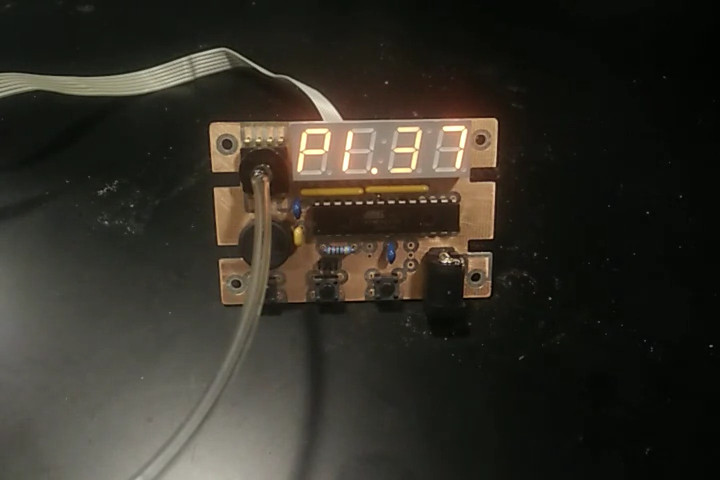
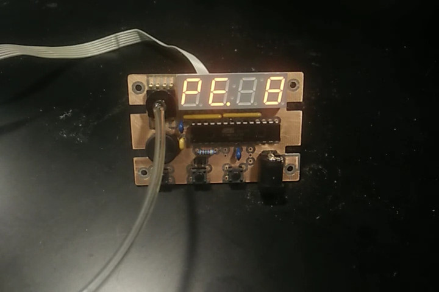
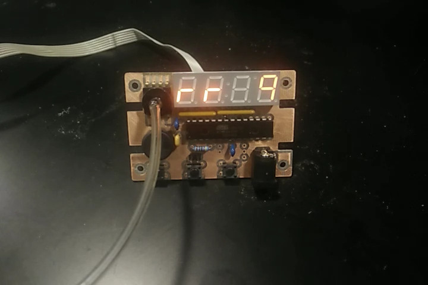

# User Guide

## Hardware Setup

1. Connect Ventmon pressure sensor to manometer port of ventilator.
2. Connect Micro USB to power source.  Rubber band power cable to strain relief.

As soon as power is connected, Ventmon will beep once to verify the buzzer is working, then begin cycling through measured parameters on its display.

## Display

Once Ventmon is powered on, it will begin cycling through three metrics:

- PIP - peak inspiratory pressure (cm H20)
- PEEP - positive end expiratory pressure (cm H20)
- respiratory rate (breaths/min)

The diagram below shows a typical pressure waveform for a pressure-cycled ventilator. The ventilator fills the lungs until the pressure reaches PIP, which triggers a valve to open for exhalation. Another valve triggers inhalation when the pressure has dropped below PEEP.

**High pressure (HP)**: the maximum pressure in a breath cycle in cm H2O, which should correspond to the peak inspiratory pressure (PIP) setting of the ventilator.

**Low pressure (LP)**: the minimum pressure in a breath cycle in cm H2O, which corresponds to the positive end-expiratory pressure (PEEP) during mandatory breathing. In assisted breathing, the minimum pressure may not correspond to PEEP.

**Respiratory rate (rr)**: the number of complete breath cycles per minute, calculated from the time between the last several breaths.

**WARNING**: The displayed parameters are averaged over several breath cycles and may take up to 30 seconds to reflect large changes in ventilator settings.

## Alarm conditions

Ventmon will generate an audible alarm if it detects that the ventilator is not operating normally and display an error code. The alarm conditions are summarized in the following table:

Condition |	Default setting |	Adjustable range | Error Code
--------- | --------------- | --------------- | ----------------
Non-cycling | 15 sec | 5-30 sec | nc
Low pressure | 5 cm H2O | ??? | LP
High pressure | 40 cm H2O | ??? | HP
Low respiratory rate | 5 breaths/min | ??? | Lr
High respiratory rate | 30 breaths/min | ??? | Hr

**Non-cycling**: Triggers if the pressure has not changed in more than the specified number of seconds. This indicates that the ventilator has stopped working.

**Low pressure**: Triggers if the pressure falls below the specified threshold. Pressure-cycled ventilators are designed to maintain positive pressure at all times, so a drop to atmospheric pressure could indicate a disconnection.

**High pressure**: Triggers if the pressure exceeds the specified threshold. Pressure-cycled ventilators should never exceed the user-specified PIP value, so a high pressure reading could indicate a mechanical failure.

**Low respiratory rate**: Triggers if the breathing rate is too slow. This could indicate that the ventilator has not been adjusted correctly.

**High respiratory rate**: Triggers if the breathing rate is too fast. This could occur if the ventilator has not been adjusted correctly or if the tidal volume is too low.

**WARNING**: The alarm can sometimes trigger incorrectly shortly after the pressure settings of the ventilator have changed. These false alarms typically occur within 30 seconds of adjustments.

## User interface

Ventmon has 3 buttons for changing modes and adjusting alarm settings

- `MODE` - cycles through display or setting modes
- `UP` - adjust alarm settings in the various settings modes
- `DOWN` - adjust alarm settings in the various settings modes

The modes that can be cycled through with the `MODE` button are

1. Display - Default mode.  Cycles through displaying measured metrics as in the [Display](userguide.md/#Display) section
2. Set High pressure - Adjust threshold for High pressure alarm condition.  The display will show `HP` along with the current setting as 2 flashing digits.
3. Set Low pressure - Adjust threshold for Low pressure alarm condition.  The display will show `LP` along with the current setting as 2 flashing digits.

Ventmon will automatically return to the Display mode after 30 seconds of no user input.

- How to silence/reset alarm
- How to enable/disable alarm
- How to adjust alarm thresholds
